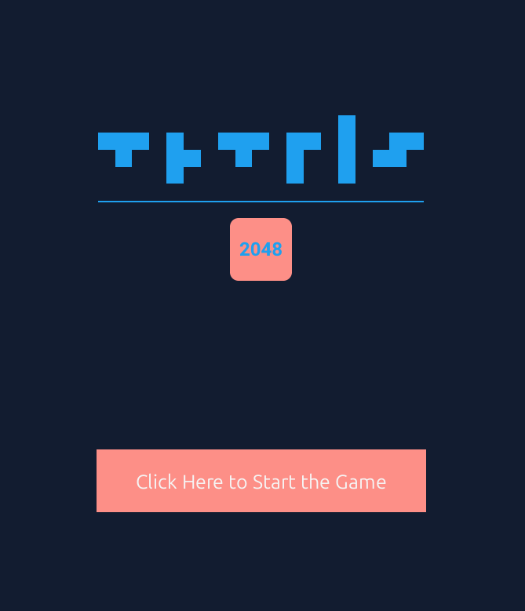
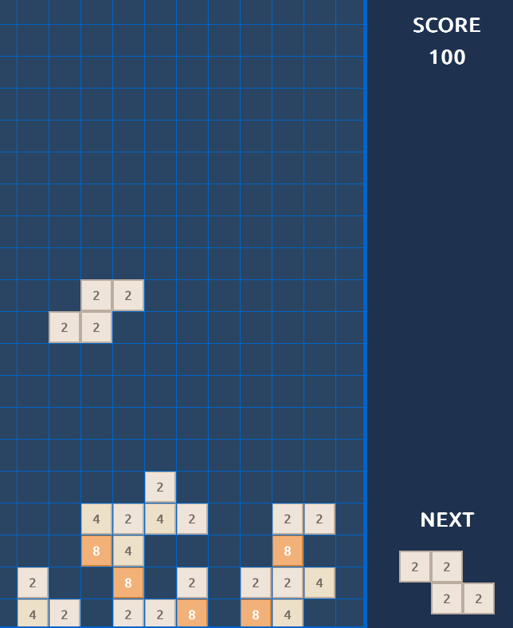

# Tetris2048

Tetris2048 is a hybrid puzzle game that combines Tetris block mechanics with 2048 tile merging. This repository contains the full source for the game, rendering, and supporting utilities.

## Overview

Tetris2048 places standard tetromino pieces on a vertical grid. Each tile contains a 2048-style number (2, 4, 8, ...). When vertically adjacent tiles share the same number they can merge according to game rules. The game integrates both row-clearing and 2048-style merges with a Tetris-style falling-piece gameplay loop.

## Screenshots

Menu screen:

In-game (grid + UI):

## Requirements

- Python 3.12 or newer (project targets Python 3.12)
- A Python environment with these packages:
  - `numpy`
  - `pygame` (used for windowing/keyboard or the provided drawing shim)

The project uses a pyproject.toml with declared dependencies. Use a virtual environment to keep system packages clean.

## Installation

1. Clone the repository:
   - `git clone https://github.com/ertanturk/tetris2048.git`
   - `cd tetris2048`

2. Create and activate a virtual environment (recommended):
   - On macOS / Linux:
     - `python3 -m venv .venv`
     - `source .venv/bin/activate`
   - On Windows (PowerShell):
     - `python -m venv .venv`
     - `.venv\Scripts\Activate.ps1`

3. Install the package (editable mode recommended):
   - `python -m pip install --upgrade pip`
   - `python -m pip install -e .`

Note: Installing via `pip install -e .` reads `pyproject.toml` and installs dependencies declared there. If you prefer, install dependencies manually: `pip install numpy pygame`.

## Running the game

After installation, the game can be started via the package entry point or module:

- From the package script (installed as console script):
  - `tetris2048`

- Or directly with Python:
  - `python -m tetris2048`

The game opens a window and shows the main menu. Click the start button to begin.

## Controls

- Left arrow: move tetromino left
- Right arrow: move tetromino right
- Down arrow: soft drop (move down)
- Space: hard drop (instantly drop to the lowest valid position)
- Up arrow: rotate tetromino (clockwise)
- Escape: pause / unpause
- R: restart the game (when paused or on game over)

## User Interface

- Main playing grid is shown at left.
- Score and "Next" piece preview are shown in the right UI panel.
- Menu provides a start button and an image header.

## Project structure

Top-level layout (key items):

- `src/tetris2048/`
  - `core/` — core data types (Point, Tile)
  - `game/` — game logic
    - `game_engine.py` — main entry and loop
    - `game_grid.py` — board, merging logic, clears and floating component handling
    - `tetromino.py` — tetromino shapes, movement, rotation
  - `rendering/` — drawing utilities and tile color palette
    - `stddraw.py` — lightweight drawing wrapper used by the engine
    - `picture.py` — image loader abstraction
    - `tile_palette.py` — tile color mapping
  - `__main__.py` — module entrypoint
- `images/` — media used by the game (menu and in-game screenshots or resources)
- `pyproject.toml` — packaging and dependency information
- `README.md` — this file

## Design notes

- Merge behavior is performed in `game_grid` and was designed to avoid repeated merges during a single lock cycle using a transient flag on tiles.
- Row clearing compacts rows toward the bottom of the grid. Floating components removal is handled separately and can be configured to apply or skip gravity depending on design choices.
- The rendering layer is decoupled from logic to keep tests and simulation simple.

## Troubleshooting

- If the menu image is not displayed, verify `images/menu_image.png` exists in the repository root. The engine attempts to load images from `images/` relative to repository root.
- If installation fails with dependency errors, ensure your Python version is 3.12 and that `pip` is upgraded.
- If the game window does not respond to keys, ensure the display has focus.

## License

This project is licensed under the MIT License. See the `LICENSE` file for details.

## Contact

-Ertan Tunç Türk
Email: turke@mef.edu.tr

-Yiğit Ali Ergül
Email: erguly@mef.edu.tr

-Lütfü Yiğit Karakozak
Email: karakozakl@mef.edu.tr

## Acknowledgements

This project was developed for educational purposes (COMP 204 Programming Studio, MEF University) and integrates classic mechanics from Tetris and 2048 for a hybrid puzzle experience.
